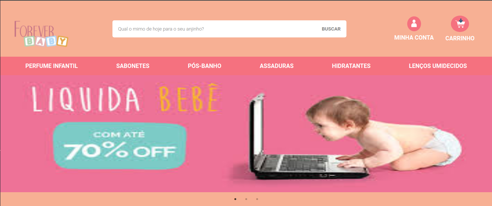
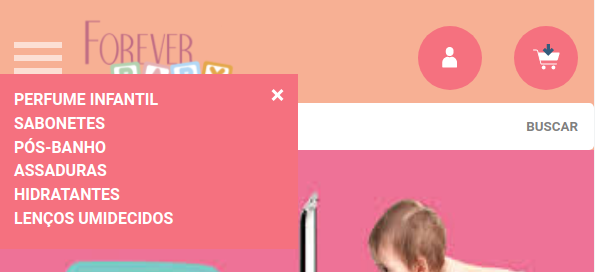
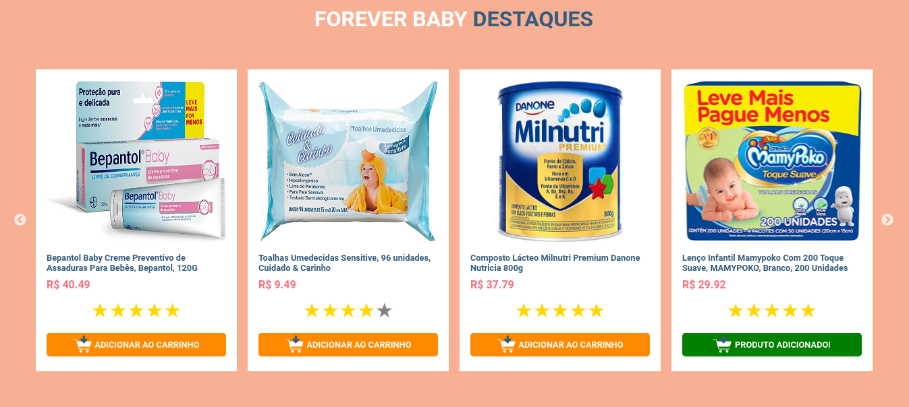
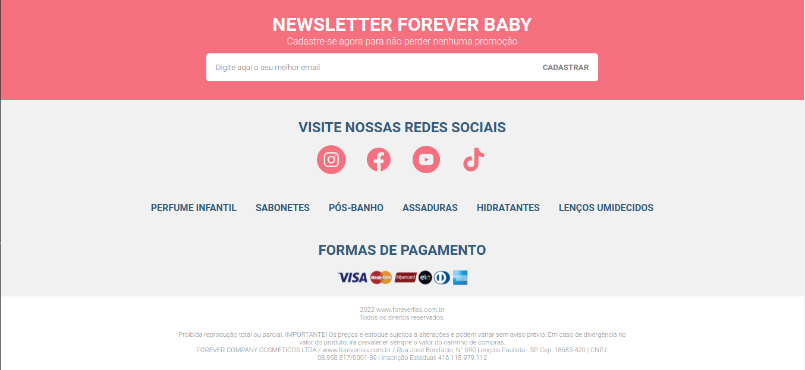

# Teste Forever

- Trata-se de o desenvolvimento de um exemplo de site de produtos voltados para bebês.

# Sumário

- [Tecnologias utilizadas](#tecnologias)
- [Instruções para rodar o projeto](#instrucoes)
- [Organização e estruturação do projeto](#organizacao)
- [Desenvolvimento](#desenvolvimento)
- [Resultado](#resultado)

# Tecnologias Utilizadas <a name="tecnologias"></a>

- [**React**](https://pt-br.reactjs.org/)
- [**React Hooks**](https://pt-br.reactjs.org/docs/hooks-intro.html)
- [**React Router Dom**](https://www.npmjs.com/package/react-router-dom)
- [**SASS**](https://sass-lang.com/)
- [**React Burger Menu**](https://www.npmjs.com/package/react-burger-menu)
- [**React Rating Stars Component**](https://www.npmjs.com/package/react-rating-stars-component)
- [**Slick Carousel**](https://react-slick.neostack.com/)
- [**Styled Icons**](https://styled-icons.dev/)
- [**Axios**](https://axios-http.com/docs/intro)

# Instruções para rodar o projeto <a name="instrucoes"></a>

### Será necessário ter instalado na sua máquina:

```
Git
React
Node v6.0.0^
```

- Clone o repositório com o comando **git clone**:

```
git clone git@github.com:danielbped/forever-baby.git
```

- Entre no diretório que acabou de ser criado:

```
cd forever-baby
```

- Para o projeto funcionar na sua máquina, será necessário instalar suas dependências, para isso, utilize o comando **npm install**:

```
npm install
```

- Pronto, agora o projeto está pronto para ser rodado localmente, utilizando o comando **npm start**:

```
npm start
```

# Organização e estruturação do projeto <a name="organizacao"></a>

O projeto está organizado e estruturado da seguinte forma:

```
      ├── README.md
      ├── public
      ├── src
      |     ├── Routes.jsx
      |     ├── App.jsx
      |     ├── index.jsx
      |     ├── assets
      |     |       ├── Carousel-items.jsx
      |     |       ├── Footer-items.jsx
      |     |       ├── Highlights-items.jsx
      |     |       ├── Navbar-items.jsx
      |     |       ├── Social-items.jsx
      |     ├── components
      |     |       ├── Carousel
      |     |       |     ├── index.jsx
      |     |       ├── Footer
      |     |       |     ├── index.jsx
      |     |       ├── Header
      |     |       |     ├── index.jsx
      |     |       |     ├── BurgerMenu.jsx
      |     |       |     ├── Button.jsx
      |     |       ├── Highlights
      |     |       |     ├── index.jsx
      |     |       |     ├── ItemCard.jsx
      |     |       ├── Input
      |     |       |     ├── index.jsx
      |     |       ├── Navbar
      |     |       |     ├── index.jsx
      |     |       ├── Newsletter
      |     |       |     ├── index.jsx
      |     |       ├── Social
      |     |       |     ├── index.jsx
      |     |       ├── index.jsx
      |     ├── pages
      |     |       ├── Main.jsx
      |     ├── scss
      |     |       ├── carousel.scss
      |     |       ├── font.scss
      |     |       ├── footer.scss
      |     |       ├── header.scss
      |     |       ├── highlights.scss
      |     |       ├── navbar.scss
      |     |       ├── newsletter.scss
      |     |       ├── reset.scss
      |     |       ├── social.scss
      |     ├── style
      |     |       ├── carousel.css
      |     |       ├── font.css
      |     |       ├── footer.css
      |     |       ├── header.css
      |     |       ├── highlights.css
      |     |       ├── navbar.css
      |     |       ├── newsletter.css
      |     |       ├── reset.css
      |     |       ├── social.css
      |     ├── svg
      |     |       ├── Icon-cart.svg
      |     |       ├── Icon-profile.svg
      |     |       ├── Payment-form.svg
      |     |       ├── Logo.svg
```

# Desenvolvimento <a name="desenvolvimento" ></a>

## Fetch

Para realizar o fetch no banco de dados fictício, foi utilizado o client HTTP [**Axios**](https://axios-http.com/docs/intro).

## Estilização

Para realizar a estilização, foi utilizado o framework [**SASS**](https://sass-lang.com/).

## Menu Hamburger

Para desenvolver o menu hamburger, foi utilizada a biblioteca [**React Burger Menu**](https://www.npmjs.com/package/react-burger-menu).

## Avaliações

Para desenvolver o componente com as estrelas de avaliação, foi utilizada a biblioteca [**React Rating Stars Component**](https://www.npmjs.com/package/react-rating-stars-component).

## Carrossel

Para desenvolver o componente de carrossel, foi utilizada a biblioteca [**Slick Carousel**](https://react-slick.neostack.com/).

## Icones

Os ícones utilizados foram os da biblioteca [**Styled Icons**](https://styled-icons.dev/).

# Resultado <a name="resultado"></a>

## Header, Navbar e Banner




## Forever Baby destaques




## Newsletter, Social e Footer


